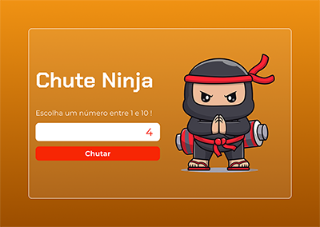
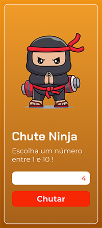

# 🥷 Chute Ninja

**Chute Ninja** é um jogo de adivinhação interativo e simples, onde o jogador deve escolher um número entre 1 e 10. Inspirado na temática ninja, o jogo combina mecânicas clássicas de adivinhação com um design visual envolvente.

## 🚀 Funcionalidades

- **Adivinhação de números**: O jogador chuta um número e recebe feedback se acertou ou se o número secreto é maior ou menor que o seu chute.
- **Interface temática ninja**: Um ninja estilizado acompanha o jogo para torná-lo mais divertido.
- **Feedback dinâmico**: Interface muda conforme o progresso do jogo.
- **Responsivo**: Funciona bem em dispositivos móveis e desktops.

---

## 🛠️ Tecnologias Utilizadas

- **HTML5**: Estrutura da página.
- **CSS3**: Estilização, responsividade e animações.
- **JavaScript**: Lógica do jogo e interatividade.

---

## 🖼️ Prototipagem

### Versão Desktop:

### Versão Mobile:

### Link para o Figma
As interfaces foram planejadas no Figma. Você pode acessá-las clicando no link abaixo:

[Interfaces no Figma](https://www.figma.com/design/F0BvSyI7PVRg59JNZw2wdu/Chute-Ninja?node-id=0-1&t=DlJEvbW8eoD8mh0b-1) <!-- Substitua o `#` pelo link do Figma -->

### Acesso Online

Você pode acessar esse projeto **online** através do github pages: [Clique aqui!](https://lukaskardeck.github.io/Chute-ninja/)